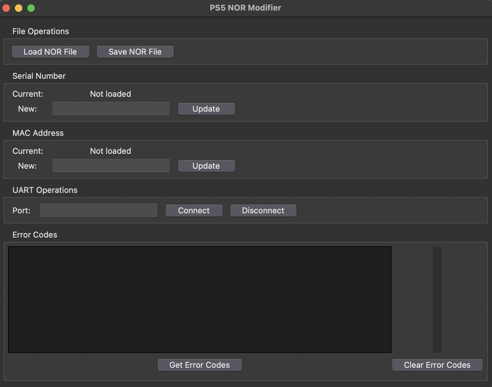

# PS5 NOR Modifier (Python Version)

This codebase would not be possible without 

https://github.com/TheCod3rYouTube/PS5NorModifier



A Python-based GUI application for modifying PlayStation 5 NOR files. This is a port of the original C# application by TheCod3r to Python, making it cross-platform and more accessible.

## Features

1. Read PS5 NOR files (PS5 Slim not currently supported)
2. Write PS5 NOR files (PS5 Slim not currently supported)
3. Change serial number on NOR file
4. Change version flags (disc edition or digital edition)
5. Read motherboard serial
6. Read WiFi MAC address
7. Read LAN MAC address

## UART Features

1. Connect to any compatible TTL device
2. Read error codes stored on PS5 system
3. Clear error codes stored on PS5 system
4. Automatically convert the error codes into easy to understand descriptions
5. Fetch error codes in real time from uartcodes.com database
6. Option to download entire uartcodes.com database for offline use
7. Send custom UART commands and receive response in output box

## Project Structure

- `src/main.py`: Application entry point
- `src/main_window.py`: GUI implementation
- `src/uart_handler.py`: UART communication and error handling
- `src/nor_handler.py`: NOR file operations and validation
- `src/__init__.py`: Package initialization

## Error Handling

The application includes a robust error handling system:

1. Custom `UartError` class for UART-specific errors
2. Input validation for:
   - Serial port names
   - Error codes
   - Custom commands
   - NOR file data
3. Detailed error messages with context
4. Graceful error recovery

## Database Management

The application supports both online and offline error code databases:

1. Online Database:
   - Real-time error code lookup
   - Automatic database updates
   - Fallback to offline mode

2. Offline Database:
   - Local XML storage
   - Automatic initialization
   - Manual update option

## Installation

1. Clone this repository
2. Install the required dependencies:
   ```bash
   pip install -r requirements.txt
   ```

## Usage

Run the main application:
```bash
python src/main.py
```

## Error Code Database

The application uses a local XML database for error codes, stored in:
```
PS5NorPY/resources/error_codes.xml
```

The database is automatically downloaded on first run and can be manually updated through the GUI.

## Contributing

Contributions are welcome! Please feel free to submit a Pull Request.
